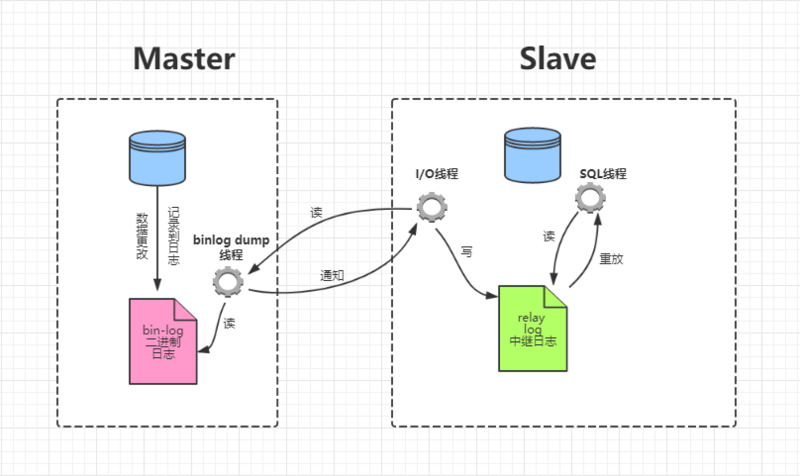
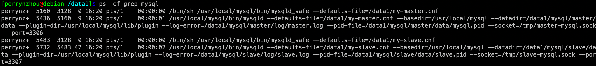

## MySQL 基于GTID主从复制

| 作者 | 时间 |QQ技术交流群 |
| ------ | ------ |------ |
| perrynzhou@gmail.com |2021/05/23 |672152841 |

#### MySQL 复制架构



#### MySQL Master节点初始化

- master节点配置
```
[client]
port = 3306
socket = /tmp/master-mysql.sock

[mysql]
no-auto-rehash

[mysqld]
sql_mode=NO_ENGINE_SUBSTITUTION,STRICT_TRANS_TABLES
user = mysql
port = 3306
socket  = /tmp/master-mysql.sock
server-id=1
port=3306
datadir=/data1/mysql/master/data
log_error=/data1/mysql/master/log/master.log
pid_file=/data1/mysql/master/data/mysql.pid
server_id=101              
gtid_mode=on              
enforce_gtid_consistency=on 
log_bin=master-binlog
log-slave-updates=1    
binlog_format=row          
skip_slave_start=1
max_connect_errors=1000
```
- master节点数据库初始化
```
mysqld --initialize-insecure --user=mysql --basedir=/usr/local/mysql --datadir=/data1/mysql/master/data

```
- master节点数据库启动

```
nohup mysqld_safe --defaults-file=/data1/my-master.cnf > master.log 2>&1 &
```


#### MySQL Slave节点初始化

- slave节点配置

```
[mysqld]
sql_mode=NO_ENGINE_SUBSTITUTION,STRICT_TRANS_TABLES
user = mysql
port = 3307
socket  = /tmp/slave-mysql.sock
datadir=/data1/mysql/slave/data
log-error = /data1/mysql/slave/log/slave.log
pid-file = /data1/mysql/slave/data/slave.pid
max_connect_errors=1000
gtid_mode=on
enforce_gtid_consistency=on
server_id=102
log-bin=slave-binlog
log-slave-updates=1
binlog_format=row     
skip_slave_start=1
```

- slave数据库初始化

```
mysqld --initialize-insecure --user=mysql --basedir=/usr/local/mysql --datadir=/data1/mysql/slave/data
```
- slave 节点数据库启动

```
nohup mysqld_safe --defaults-file=/data1/my-slave.cnf > slave.log 2>&1 &
```



#### 主从节点创建超级用户

- master节点
```
[perrynzhou@debian /data1]$ mysql -uroot -P  3306 -S /tmp/master-mysql.sock  
mysql> create user 'admin'@'%' identified by 'admin';
mysql> grant all privileges on *.* to 'admin'@'%';      
mysql> flush privileges;
```

#### GTID复制配置

- 主节点创建复制用户

```
[perrynzhou@debian /data1]$ mysql -uroot -P  3306 -S /tmp/master-mysql.sock  
mysql> create user 'repl'@'%' identified by 'repl';
mysql> grant replication slave,replication client on *.* to 'repl'@'%';
mysql> flush privileges;
```

- slave节点验证master节点的复制用户

```
mysql -urepl   -prepl   -h127.0.0.1 -P 3306
```
-  slave节点配置主从复制

```
[perrynzhou@debian /data1]$ mysql -uroot   -S /tmp/slave-mysql.sock   -P 3307 -p
mysql> change master to  
			master_host='127.0.0.1',    
      master_user='repl',    
      master_password='repl',    
      master_port=3306,   
      master_auto_position=1;
mysql> start slave;
```
- slave复制状态

```
mysql> show slave status\G
*************************** 1. row ***************************
               Slave_IO_State: Waiting for master to send event
                  Master_Host: 127.0.0.1
                  Master_User: repl
                  Master_Port: 3306
                Connect_Retry: 60
              Master_Log_File: master-binlog.000007
          Read_Master_Log_Pos: 3452
               Relay_Log_File: debian-relay-bin.000006
                Relay_Log_Pos: 470
        Relay_Master_Log_File: master-binlog.000007
             Slave_IO_Running: Yes
            Slave_SQL_Running: Yes
              Replicate_Do_DB: 
          Replicate_Ignore_DB: 
           Replicate_Do_Table: 
       Replicate_Ignore_Table: 
      Replicate_Wild_Do_Table: 
  Replicate_Wild_Ignore_Table: 
                   Last_Errno: 0
                   Last_Error: 
                 Skip_Counter: 0
          Exec_Master_Log_Pos: 3452
              Relay_Log_Space: 994
              Until_Condition: None
               Until_Log_File: 
                Until_Log_Pos: 0
           Master_SSL_Allowed: No
           Master_SSL_CA_File: 
           Master_SSL_CA_Path: 
              Master_SSL_Cert: 
            Master_SSL_Cipher: 
               Master_SSL_Key: 
        Seconds_Behind_Master: 0
Master_SSL_Verify_Server_Cert: No
                Last_IO_Errno: 0
                Last_IO_Error: 
               Last_SQL_Errno: 0
               Last_SQL_Error: 
  Replicate_Ignore_Server_Ids: 
             Master_Server_Id: 101
                  Master_UUID: 6443e6e9-bb9c-11eb-bee9-001c420bbbe1
             Master_Info_File: mysql.slave_master_info
                    SQL_Delay: 0
          SQL_Remaining_Delay: NULL
      Slave_SQL_Running_State: Slave has read all relay log; waiting for more updates
           Master_Retry_Count: 86400
                  Master_Bind: 
      Last_IO_Error_Timestamp: 
     Last_SQL_Error_Timestamp: 
               Master_SSL_Crl: 
           Master_SSL_Crlpath: 
           Retrieved_Gtid_Set: 6443e6e9-bb9c-11eb-bee9-001c420bbbe1:1-13
            Executed_Gtid_Set: 6443e6e9-bb9c-11eb-bee9-001c420bbbe1:1-13,
77c34ad3-bb9e-11eb-b695-001c420bbbe1:1-17
                Auto_Position: 1
         Replicate_Rewrite_DB: 
                 Channel_Name: 
           Master_TLS_Version: 
       Master_public_key_path: 
        Get_master_public_key: 0
            Network_Namespace: 
1 row in set, 1 warning (0.02 sec)
```


